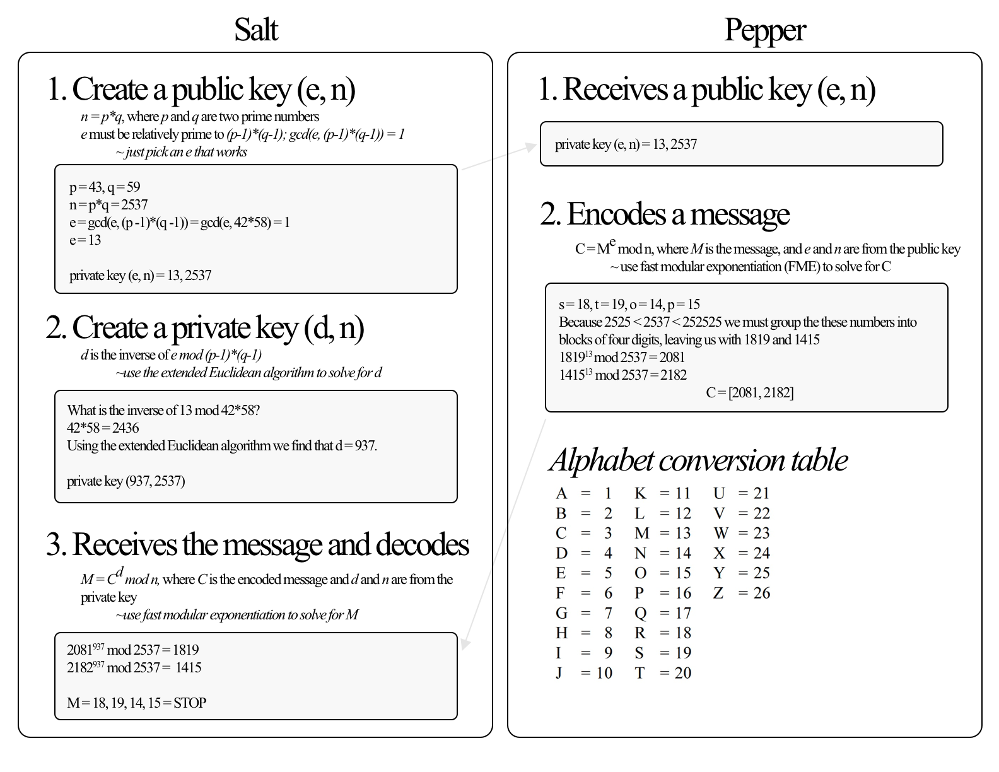

# RSA
RSA is an algorithm used to encrypt and decrypt messages.  The algorithm uses public and private keys along with modular arithmetic and prime factorization to make this type of encryption impossible to decode with large numbers. 

The image below walks you through what an encryption and decryption would look like between two parties; Salt and Pepper, passing the message "STOP". 

It might also be helpful to review the ["Introduction to RSA" with Khan Academy](https://www.khanacademy.org/computing/computer-science/cryptography/modern-crypt/v/intro-to-rsa-encryption)

## How to Use the App
1. Open the file RSA.ipynb in either GitHub or an environment that supports IPython Notebook.
2. Follow along each of the cells to become familiar with each function.  -OR-
3. Skip to the main() function in the notebook and start encrypting and decrypting your own messages.  Start with GetKeys(), then "Encode", followed by "Decode", copying and pasting your results to save for the next step.
4. Enjoy!
